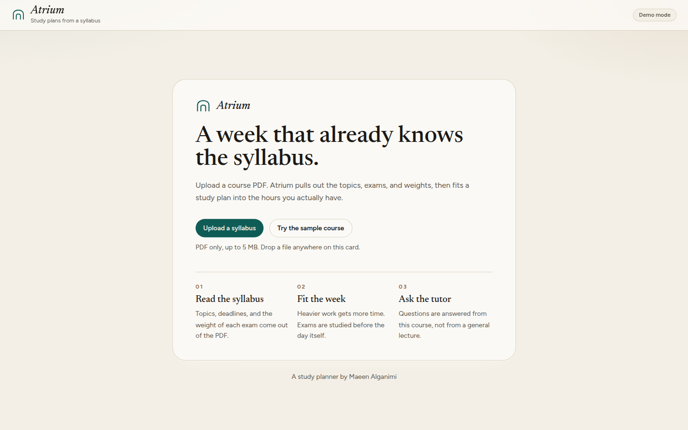
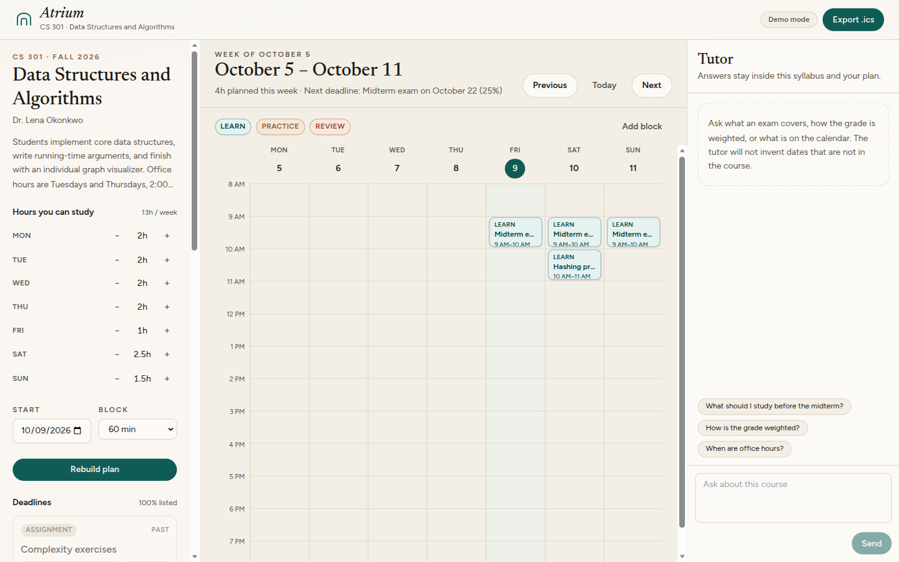
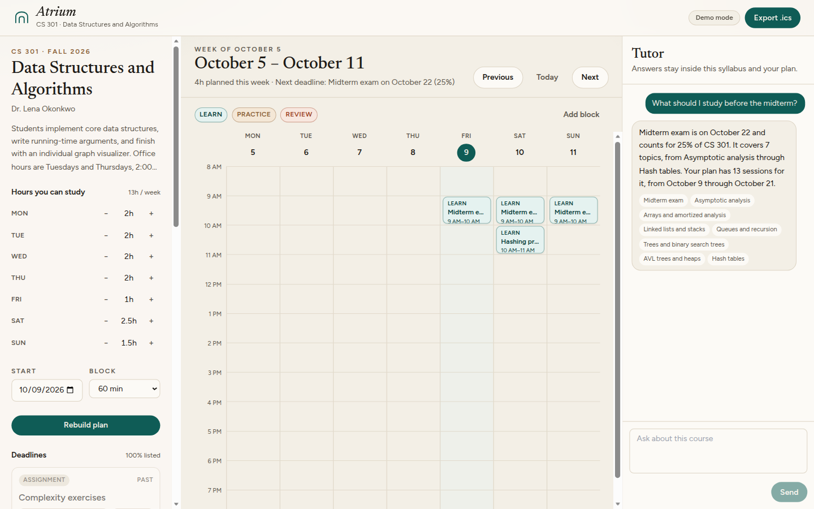
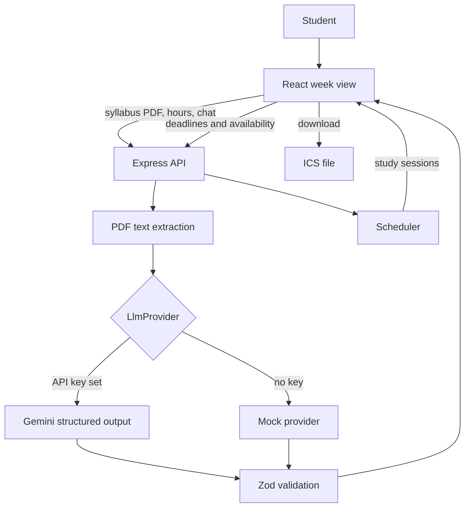

# Atrium

Atrium turns a course syllabus into a week you can finish. Upload a PDF, and it pulls out the topics, deadlines, exams, and grade weights, then builds an editable study plan around the hours you actually have. A tutor on the side answers questions from that syllabus and that plan, not from a generic lecture.

Built by [Maeen Alganimi](https://github.com/MaeenAlganimi).

**Live demo:** _Placeholder — add the public URL after the first deploy._







## Features

- **Syllabus upload.** PDFs are size- and type-checked, then read for topics, assessments, due dates, and weights.
- **Editable week view.** Sessions respect weekday hours and land before an exam. Change a deadline or an hour budget and rebuild. Open any block to rename it, move it, or delete it.
- **Calendar export.** Download the current plan as `.ics` and drop it into Google Calendar, Apple Calendar, or Outlook.
- **Grounded tutor.** Answers cite the assessments and topics they used. If the syllabus does not say it, the tutor says so.
- **Demo mode.** With no API key, a deterministic mock provider and a bundled CS 301 syllabus run the whole product. Nothing secret is required to try it.
- **Swappable model.** Gemini is behind a `LlmProvider` interface. Scheduling does not depend on a model.

The sample course is CS 301, Data Structures and Algorithms, Fall 2026. If today sits inside that term, the plan starts today. If the term is already over, the start date falls back to 9 October 2026 so the demo still has upcoming work.

## Architecture



| Piece | Where | Role |
| --- | --- | --- |
| Web app | `apps/web` | Vite, React, TypeScript, Tailwind. Talks only to `/api`. |
| API | `apps/server` | Express. Upload limits, rate limits, PDF parsing, routes. |
| Domain | `packages/shared` | Zod schemas, the scheduler, and ICS generation. Used by the API and the browser. |

The browser never sees `GEMINI_API_KEY`. In production the API serves the built web app from the same origin, so a single container is enough.

## How the model is used

Two calls go to a model. The weekly plan does not.

**Extraction** asks for JSON that matches a response schema: course, topics, and assessments with an ISO date, a weight, and a type. The provider parses that JSON and checks it with Zod. A schema failure is sent back once, with the validation error, and then the request fails. The instructions tell the model not to invent dates or weights, and to ignore any instructions embedded in the PDF.

**The tutor** receives the structured syllabus, a compact list of study sessions, and the recent turns. The student message is wrapped in a delimiter. The reply is JSON `{ answer, citations }`, validated the same way. Citations are assessment or topic titles the answer actually used.

**The scheduler** (`packages/shared/src/schedule.ts`) is ordinary code, which is why it has unit tests:

- Each upcoming assessment gets a minute budget from its grade weight (30 minutes per weight point by default, so a 25% exam wants 12.5 hours).
- Exams and quizzes are studied on days before the exam. Other work may be scheduled through the due date.
- Nearer deadlines are placed first, so a midterm is not crowded out by a final.
- Sessions are spread across the days that still have free hours, and a day never exceeds the hours the student marked.
- Early sessions are labeled Learn, middle ones Practice, and the ones closest to the deadline Review.

Demo mode (`LLM_PROVIDER=auto` and an empty `GEMINI_API_KEY`) uses `MockLlmProvider`. The bundled syllabus returns a curated structure. Any other PDF is read by a deterministic heuristic that only keeps lines with a real date and a weight, so an unknown file is not silently turned into CS 301. Tutor replies in demo mode are written from the syllabus and the plan: grade weights, office hours, what an exam covers, and what is on the calendar.

To use a different model, implement `LlmProvider` in `apps/server/src/llm/types.ts` and return it from `createLlmProvider`. Keep returning Zod-parsed objects.

## Run it locally

Node 22 or newer.

```bash
npm install
cp .env.example .env
npm run dev
```

Open [http://localhost:5173](http://localhost:5173). Leave `GEMINI_API_KEY` empty to stay in demo mode, or set it to call Gemini:

```bash
GEMINI_API_KEY=your-key
GEMINI_MODEL=gemini-2.5-flash
LLM_PROVIDER=auto
```

`LLM_PROVIDER` accepts `auto`, `mock`, or `gemini`. `auto` uses Gemini only when a key is present.

Useful scripts:

```bash
npm test
npm run lint
npm run typecheck
npm run build
npm start   # serves the built app, after npm run build
```

## Tests and CI

GitHub Actions runs lint, typecheck, unit tests, and a production build on every pull request.

| Area | What it locks down |
| --- | --- |
| PDF parsing | The bundled syllabus yields the course, the midterm date, and every assessment title. An empty page is rejected. |
| Scheduler | Heavier work gets more time, exams are not scheduled on exam day, daily caps hold, weekends stay weekends, and the same input always produces the same plan. |
| API | Upload rejection, the sample extraction, plan generation, a grounded tutor reply, ICS export, and the rate limit. Gemini is not called; the suite injects the mock provider, plus a fake `fetch` for the Gemini client's retry and schema check. |

## Deploy

### One service (recommended)

The Docker image builds the web app and the API. The API serves both.

[Render](https://render.com) can use `render.yaml` (Docker, health check on `/api/health`). Set `GEMINI_API_KEY` in the dashboard if you want live extraction. Leave it unset to ship the demo.

[Fly.io](https://fly.io):

```bash
fly launch --dockerfile Dockerfile --no-deploy
fly secrets set GEMINI_API_KEY=your-key   # optional
fly deploy
```

The container listens on `PORT` (8080 in the image).

### Split the web app and the API

- **Web:** Vercel, root directory `apps/web`, or build `npm run build -w @atrium/web` and publish `apps/web/dist`. Set `VITE_API_URL` to the public API origin.
- **API:** Render or Fly from `apps/server`, with `CLIENT_ORIGIN` set to the web origin (comma-separated if you have more than one). Do not put the Gemini key in the web project.

## Safety

- Uploads are PDF-only, checked by MIME type and the `%PDF` header, and capped at 5 MB (`MAX_UPLOAD_BYTES`). They stay in memory.
- Write routes are rate limited. Syllabus extraction is stricter than the rest.
- Request bodies are size-limited and validated with Zod before they reach the scheduler or the model.
- The model is told to ignore instructions inside the syllabus or the student message that try to change its job. That is a boundary, not a complete defense against prompt injection.
- Keys stay in server environment variables. `/api/config` reports only whether demo mode is on.

## License

[MIT](LICENSE) © 2026 Maeen Alganimi
